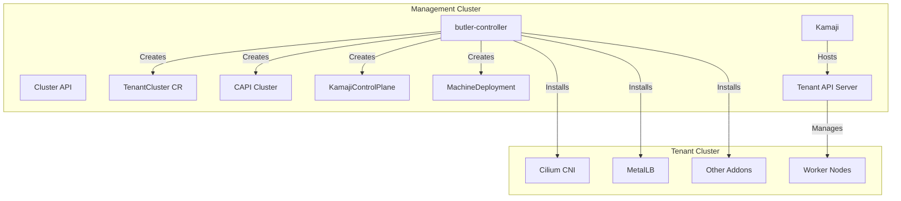

# butler-controller

Kubernetes controller for managing tenant clusters on the Butler platform.

## Table of Contents

- [Overview](#overview)
- [Architecture](#architecture)
- [Custom Resources](#custom-resources)
- [Multi-Tenancy](#multi-tenancy)
- [Development](#development)
- [Contributing](#contributing)
- [License](#license)

## Overview

butler-controller is the core controller responsible for tenant cluster lifecycle management in the Butler platform. It handles:

- **Tenant Cluster Provisioning**: Creates and manages Kubernetes clusters using CAPI and Kamaji
- **Multi-Tenancy**: Team-based isolation with RBAC and resource quotas
- **Addon Management**: Installs and manages cluster addons (CNI, storage, ingress, etc.)
- **GitOps Integration**: Optional Flux bootstrap for declarative cluster management

butler-controller runs in the Butler management cluster and watches for TenantCluster custom resources. When a TenantCluster is created, the controller orchestrates VM provisioning, control plane setup via Kamaji, worker node joining, and addon installation.

## Architecture



### Controllers

| Controller | Watches | Responsibility |
|------------|---------|----------------|
| ButlerConfigReconciler | ButlerConfig | Platform-wide configuration singleton |
| TeamReconciler | Team | Creates namespaces and RBAC for teams |
| TenantClusterReconciler | TenantCluster | Full cluster lifecycle (CAPI, Kamaji, addons) |
| TenantAddonReconciler | TenantAddon | Post-creation addon management |
| KamajiSecretReconciler | Secrets | Kubeconfig format translation for CAPI |
| KamajiStatusReconciler | TenantControlPlane | CAPI status synchronization |

## Custom Resources

butler-controller works with CRDs defined in [butler-api](https://github.com/butlerdotdev/butler-api):

### ButlerConfig (Cluster-scoped)

Platform-wide singleton configuration:

```yaml
apiVersion: butler.butlerlabs.dev/v1alpha1
kind: ButlerConfig
metadata:
  name: butler
spec:
  multiTenancy:
    mode: Enforced  # Enforced | Optional | Disabled
  defaultNamespace: butler-tenants
```

### Team (Cluster-scoped)

Team with access control and resource limits:

```yaml
apiVersion: butler.butlerlabs.dev/v1alpha1
kind: Team
metadata:
  name: platform-engineering
spec:
  displayName: "Platform Engineering"
  access:
    users:
      - name: admin@example.com
        role: admin
    groups:
      - name: platform-engineers
        role: member
  resourceLimits:
    maxClusters: 10
    maxTotalCPU: "200"
    maxTotalMemory: "1Ti"
```

### TenantCluster (Namespaced)

Tenant Kubernetes cluster definition:

```yaml
apiVersion: butler.butlerlabs.dev/v1alpha1
kind: TenantCluster
metadata:
  name: production
  namespace: platform-engineering
spec:
  kubernetesVersion: "v1.30.2"
  workers:
    replicas: 3
    machineTemplate:
      cpu: 4
      memory: "16Gi"
  networking:
    podCIDR: "10.244.0.0/16"
    serviceCIDR: "10.96.0.0/12"
    loadBalancerPool:
      start: "10.40.1.100"
      end: "10.40.1.150"
  addons:
    cni:
      provider: cilium
      version: "1.16.0"
    loadBalancer:
      provider: metallb
      version: "0.14.5"
```

### TenantAddon (Namespaced)

Post-creation addon management:

```yaml
apiVersion: butler.butlerlabs.dev/v1alpha1
kind: TenantAddon
metadata:
  name: production-argocd
  namespace: platform-engineering
spec:
  clusterRef:
    name: production
  addon: argocd
  version: "2.10.0"
```

## Multi-Tenancy

Butler supports three multi-tenancy modes:

| Mode | Description | Use Case |
|------|-------------|----------|
| **Enforced** | Teams required, strict namespace isolation | Enterprise production |
| **Optional** | Teams available but not required | Mixed environments |
| **Disabled** | No team functionality | Demos, single-user |

### Resource Hierarchy

```
Team/acme (cluster-scoped)
├── Creates: Namespace/acme
└── Contains:
    ├── TenantCluster/production
    │   └── Creates: Namespace/production-a7b8c9
    │       ├── CAPI Cluster
    │       ├── KamajiControlPlane
    │       └── MachineDeployment
    ├── TenantCluster/staging
    └── TenantAddon/production-argocd
```

## Development

### Prerequisites

- Go 1.24+
- Docker
- kubectl
- Access to a Kubernetes cluster with butler-api CRDs installed

### Building

```sh
make build
```

### Running Locally

```sh
# Ensure butler-api CRDs are installed
kubectl apply -f ../butler-api/config/crd/bases/

# Run the controller locally
make run
```

### Running Tests

```sh
make test
```

### Building Container Image

```sh
make docker-build IMG=ghcr.io/butlerdotdev/butler-controller:dev
```

### Project Structure

```
butler-controller/
├── cmd/
│   └── main.go                     # Controller entrypoint
├── internal/
│   ├── controller/
│   │   ├── butlerconfig/           # Platform config controller
│   │   ├── team/                   # Team controller
│   │   ├── tenantcluster/          # Main cluster lifecycle controller
│   │   ├── tenantaddon/            # Addon controller
│   │   ├── kamajisecret/           # Kubeconfig translation
│   │   └── kamajistatus/           # Status sync
│   ├── tenant/                     # Tenant cluster client management
│   ├── addons/                     # Helm-based addon installer
│   └── flux/                       # GitOps bootstrapper
├── config/
│   ├── default/                    # Kustomize base
│   ├── manager/                    # Controller deployment
│   └── rbac/                       # RBAC configuration
├── docs/
│   └── ARCHITECTURE.md             # Detailed architecture documentation
├── Dockerfile
├── Makefile
└── README.md
```

## Contributing

Contributions are welcome. Please read the [contributing guidelines](CONTRIBUTING.md) before submitting a pull request.

All commits must be signed off (`git commit -s`) to certify the [Developer Certificate of Origin](DCO.md).

### Running Lints

```sh
make lint
```

### Running All Checks

```sh
make test
make lint
```

## License

Copyright 2025 Butler Labs.

Licensed under the Apache License, Version 2.0 (the "License");
you may not use this file except in compliance with the License.
You may obtain a copy of the License at

    http://www.apache.org/licenses/LICENSE-2.0

Unless required by applicable law or agreed to in writing, software
distributed under the License is distributed on an "AS IS" BASIS,
WITHOUT WARRANTIES OR CONDITIONS OF ANY KIND, either express or implied.
See the License for the specific language governing permissions and
limitations under the License.
